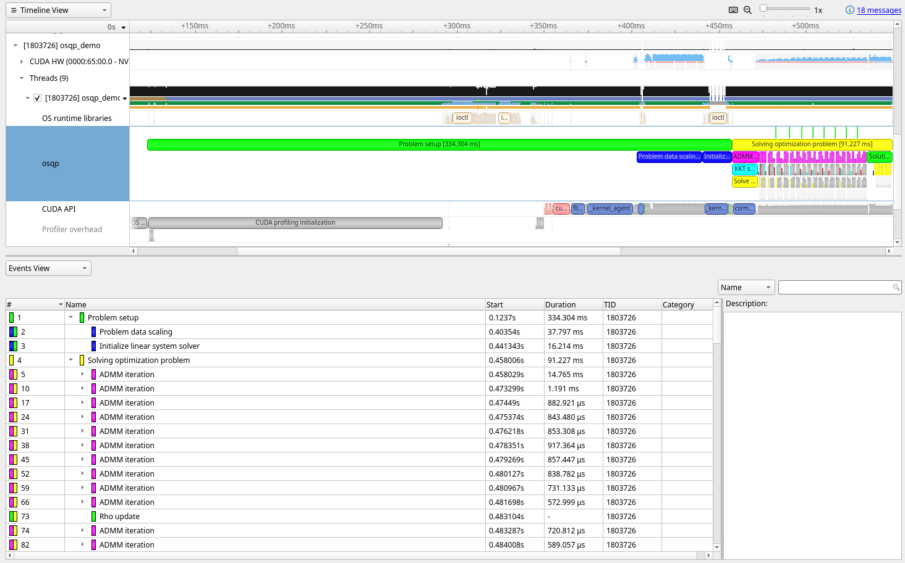
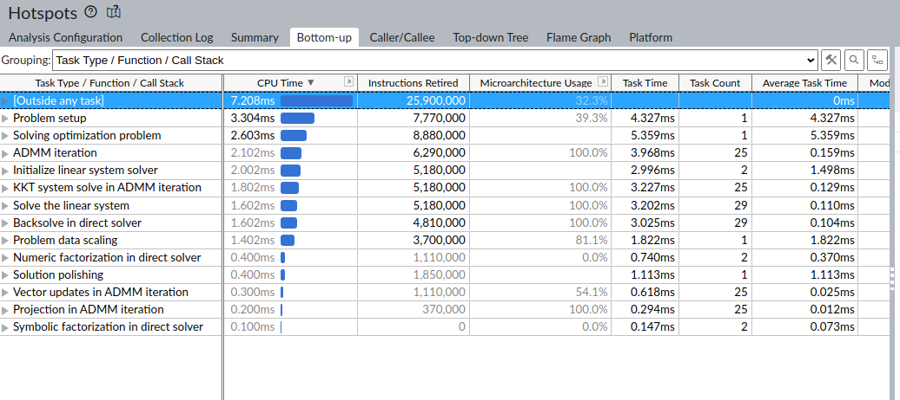
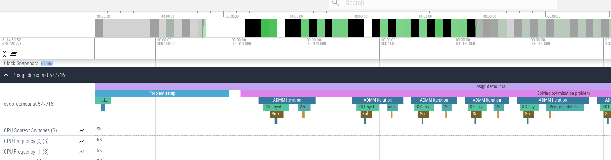

Profiling
=========

OSQP includes two mechanisms for measuring the amount of time spent in the solver:

* Basic profiling - provides simple measurements of start/stop times for the solver
* Advanced profiling - Annotates regions of the code so external profilers (e.g. NVidia Nsight, Intel VTune, etc.)
  can measure the time of each part of the solver.

Basic Profiling
---------------

Basic solver profiling is enabled by the :code:`OSQP_ENABLE_PROFILING` CMake build option, and uses the system's
clock to time the setup and solve phases.
The runtime for the solver is displayed alongside the solver status when the solver finishes, and is also contained
inside fields of the :c:struct:`OSQPInfo` structure.

Advanced Profiling
------------------

Advanced solver profiling is available with the use of the following external tools:

* :ref:`NVidia Nsight<adv_profile_nvidia_nsight>`
* :ref:`Intel VTune<adv_profile_intel_vtune>`
* :ref:`AMD OmniTrace<adv_profile_amd_omnitrace>`

While these profilers can be used with normal builds of OSQP, using the OSQP CMake build option
:code:`OSQP_PROFILER_ANNOTATIONS` will enable section annotation, telling the profiler when sections
of the code start/end to allow more fine-grained timing of individual sections of the various solver phases.

At runtime, the OSQP profiler annotations are controlled using the :cpp:var:`OSQPSettings::profiler_level`
settings variable.
This setting can take three different values:

* :code:`0` - Disable all annotation information
* :code:`1` - Annotate only OSQP ADMM sections
* :code:`2` - Annotate both OSQP ADMM sections and underlying linear algebra sections

.. _adv_profile_nvidia_nsight:

NVidia Nsight
^^^^^^^^^^^^^

When using the NVidia CUDA algebra backend with the profiler annotations enabled, only the `NVidia Nsight`_
profiler should be used.
OSQP uses the NVidia NVTX library library to report solver sections, which is selected using the
:code:`OSQP_PROFILER_ANNOTATIONS=nvtx` CMake option during configuration.

Once compiled with the NVTX library support, OSQP will report profiling information when run using the `NVidia Nsight`_
profiler tool. The timing information will be namespaced into the :code:`osqp` domain, and is reported in the NVTX ranges
section of any reports produced.

.. _NVidia Nsight: https://developer.nvidia.com/nsight-graphics

Command line profiling
~~~~~~~~~~~~~~~~~~~~~~

To use the command line to profile the demo executable with the CUDA algebra and report the OSQP timings,
the following should be run on Linux:

.. code:: bash

   nsys profile -o <report_name> osqp_demo
   nsys analyze <report_name>.nsys-rep
   nsys stats --report nvtx_sum <report_name>.sqlite

This will then report all the timing information for the OSQP sections of the code in a table on the command line,
similar to the one shown below.

.. code::

   ** NVTX Range Summary (nvtx_sum):

   Time (%)  Total Time (ns)  Instances    Avg (ns)       Med (ns)      Min (ns)     Max (ns)    StdDev (ns)    Style                    Range                 
   --------  ---------------  ---------  -------------  -------------  -----------  -----------  ------------  -------  ---------------------------------------
      47.8      337,159,170          1  337,159,170.0  337,159,170.0  337,159,170  337,159,170           0.0  PushPop  osqp:Problem setup                     
      13.1       92,137,833          1   92,137,833.0   92,137,833.0   92,137,833   92,137,833           0.0  PushPop  osqp:Solving optimization problem      
       9.4       66,362,729         94      705,986.5      466,710.5      278,144   13,770,989   1,435,295.6  PushPop  osqp:Solve the linear system           
       9.2       64,993,272         90      722,147.5      540,812.5      352,410   14,033,099   1,448,686.7  PushPop  osqp:ADMM iteration                    
       8.4       59,295,017         90      658,833.5      482,775.0      295,428   13,872,670   1,437,104.2  PushPop  osqp:KKT system solve in ADMM iteration
       5.4       37,863,537          1   37,863,537.0   37,863,537.0   37,863,537   37,863,537           0.0  PushPop  osqp:Problem data scaling              
       2.4       17,114,751          2    8,557,375.5    8,557,375.5      877,863   16,236,888  10,860,470.7  PushPop  osqp:Initialize linear system solver   
       2.0       13,913,196          1   13,913,196.0   13,913,196.0   13,913,196   13,913,196           0.0  PushPop  osqp:Solution polishing                
       1.3        9,058,039        301       30,093.2       27,691.0       23,970       88,999       8,018.7  PushPop  osqp:Matrix-vector multiplication      
       0.8        5,615,895         90       62,398.8       55,515.5       47,176      158,284      19,590.5  PushPop  osqp:Vector updates in ADMM iteration  
       0.2        1,712,233         90       19,024.8       16,265.5       14,119       72,884       7,576.9  PushPop  osqp:Projection in ADMM iteration      

GUI Profiling
~~~~~~~~~~~~~

To use the `NVidia Nsight`_ GUI to profile OSQP, ensure that the `Collect NVTX trace` project option is selected, and the 
:code:`osqp` domain is included in any NVTX domain filters that are setup.
Then, the OSQP sections will be shown on the timeline, and all the OSQP sections and events can be seen in the `Events view`.
A sample of the Nsight GUI with OSQP section information included is shown below.

.. _adv_profile_intel_vtune:

Intel VTune
^^^^^^^^^^^

When using CPU-based backends, OSQP can be profiled using the `Intel VTune`_ profiler.
OSQP integration with VTune is enabled using the :code:`OSQP_PROFILER_ANNOTATIONS=itt` CMake build
option, which enables the ITT (Instrumentation and Tracing Technology APIs) library for reporting section
information.
OSQP reports the various parts of the solver as a `Task` under the ::code:`osqp` domain.

.. _Intel VTune: https://www.intel.com/content/www/us/en/developer/tools/oneapi/vtune-profiler.html#gs.6g073h

GUI Profiling
~~~~~~~~~~~~~

To use `Intel VTune`_ to profile OSQP with the profiler annotations, run a `Hotspot` analysis, and ensure the
`Analyze user tasks, events and counters` option is selected.
Once run, the OSQP annotations can be seen in the application's trace in the `Platform` timeline view, and
also in the tooltip when the mouse hovers over an item in the timeline, as shown below.

.. image:: ../_static/img/VTune_Timeline.png
    :alt: Sample VTune timeline panel

More exact information about the various timings and all the function calls in each part of the solver can be viewed
on the `Bottom-up` tab of the analysis window, with the `Task Type / Function / Call Stack` grouping, as shown below.

.. _adv_profile_amd_omnitrace:

AMD OmniTrace
^^^^^^^^^^^^^

OSQP can be profiled using the `AMD OmniTrace`_ profiler, where OSQP will use the OmniTrace user API
to report sections of the code for timing. To enable the section reporting, use the :code:`OSQP_PROFILER_ANNOTATIONS=omnitrace`
CMake option during configuration.

.. _AMD OmniTrace: https://amdresearch.github.io/omnitrace/index.html

OmniTrace uses the command line to profile and report the OSQP timings.
To build and run an instrumented OSQP executable, the following should be run on Linux (replacing :code:`osqp_demo` with
the desired program):

.. code:: bash

   omnitrace-instrument -l --min-instructions=8 -o -- ./osqp_demo
   omnitrace-run --profile -- ./osqp_demo.inst 20 4 100

After running, this creates a new directory containing the output, with a directory for each run inside.
The timings for each section of the code can be viewed in the `wall_clock.txt` file, with a machine-readable timing report
in the `wall_clock.json` file.
A sample `wall_clock.txt` output is shown below.

.. code::

    |--------------------------------------------------------------------------------------------------------------------------------------------------------------------------|
    |                                                                 REAL-CLOCK TIMER (I.E. WALL-CLOCK TIMER)                                                                 |
    |--------------------------------------------------------------------------------------------------------------------------------------------------------------------------|
    |                        LABEL                          | COUNT  | DEPTH  |   METRIC   | UNITS  |   SUM    |   MEAN   |   MIN    |   MAX    |   VAR    | STDDEV   | % SELF |
    |-------------------------------------------------------|--------|--------|------------|--------|----------|----------|----------|----------|----------|----------|--------|
    | |0>>> osqp_demo.inst                                  |      1 |      0 | wall_clock | sec    | 0.001535 | 0.001535 | 0.001535 | 0.001535 | 0.000000 | 0.000000 |   65.2 |
    | |0>>> |_Problem setup                                 |      1 |      1 | wall_clock | sec    | 0.000074 | 0.000074 | 0.000074 | 0.000074 | 0.000000 | 0.000000 |   69.2 |
    | |0>>>   |_Problem data scaling                        |      1 |      2 | wall_clock | sec    | 0.000008 | 0.000008 | 0.000008 | 0.000008 | 0.000000 | 0.000000 |  100.0 |
    | |0>>>   |_Initialize linear system solver             |      1 |      2 | wall_clock | sec    | 0.000015 | 0.000015 | 0.000015 | 0.000015 | 0.000000 | 0.000000 |   85.0 |
    | |0>>>     |_Symbolic factorization in direct solver   |      1 |      3 | wall_clock | sec    | 0.000001 | 0.000001 | 0.000001 | 0.000001 | 0.000000 | 0.000000 |  100.0 |
    | |0>>>     |_Numeric factorization in direct solver    |      1 |      3 | wall_clock | sec    | 0.000001 | 0.000001 | 0.000001 | 0.000001 | 0.000000 | 0.000000 |  100.0 |
    | |0>>> |_Solving optimization problem                  |      1 |      1 | wall_clock | sec    | 0.000460 | 0.000460 | 0.000460 | 0.000460 | 0.000000 | 0.000000 |   16.9 |
    | |0>>>   |_ADMM iteration                              |     25 |      2 | wall_clock | sec    | 0.000331 | 0.000013 | 0.000012 | 0.000020 | 0.000000 | 0.000002 |   33.2 |
    | |0>>>     |_KKT system solve in ADMM iteration        |     25 |      3 | wall_clock | sec    | 0.000136 | 0.000005 | 0.000005 | 0.000009 | 0.000000 | 0.000001 |   46.3 |
    | |0>>>       |_Solve the linear system                 |     25 |      4 | wall_clock | sec    | 0.000073 | 0.000003 | 0.000003 | 0.000004 | 0.000000 | 0.000000 |   80.5 |
    | |0>>>         |_Backsolve in direct solver            |     25 |      5 | wall_clock | sec    | 0.000014 | 0.000001 | 0.000001 | 0.000001 | 0.000000 | 0.000000 |  100.0 |
    | |0>>>     |_Vector updates in ADMM iteration          |     25 |      3 | wall_clock | sec    | 0.000086 | 0.000003 | 0.000003 | 0.000010 | 0.000000 | 0.000002 |   76.4 |
    | |0>>>       |_Projection in ADMM iteration            |     25 |      4 | wall_clock | sec    | 0.000020 | 0.000001 | 0.000000 | 0.000008 | 0.000000 | 0.000001 |  100.0 |
    | |0>>>   |_Solution polishing                          |      1 |      2 | wall_clock | sec    | 0.000051 | 0.000051 | 0.000051 | 0.000051 | 0.000000 | 0.000000 |   32.8 |
    | |0>>>     |_Initialize linear system solver           |      1 |      3 | wall_clock | sec    | 0.000009 | 0.000009 | 0.000009 | 0.000009 | 0.000000 | 0.000000 |   83.8 |
    | |0>>>       |_Symbolic factorization in direct solver |      1 |      4 | wall_clock | sec    | 0.000001 | 0.000001 | 0.000001 | 0.000001 | 0.000000 | 0.000000 |  100.0 |
    | |0>>>       |_Numeric factorization in direct solver  |      1 |      4 | wall_clock | sec    | 0.000001 | 0.000001 | 0.000001 | 0.000001 | 0.000000 | 0.000000 |  100.0 |
    | |0>>>     |_Solve the linear system                   |      4 |      3 | wall_clock | sec    | 0.000025 | 0.000006 | 0.000003 | 0.000016 | 0.000000 | 0.000006 |   91.1 |

Additionally, OmniTrace outputs a trace file suitable for importing into the `Perfetto`_ timeline viewer.
Once imported, the section labels appear in the timeline view, as shown below.

.. _Perfetto: https://ui.perfetto.dev/